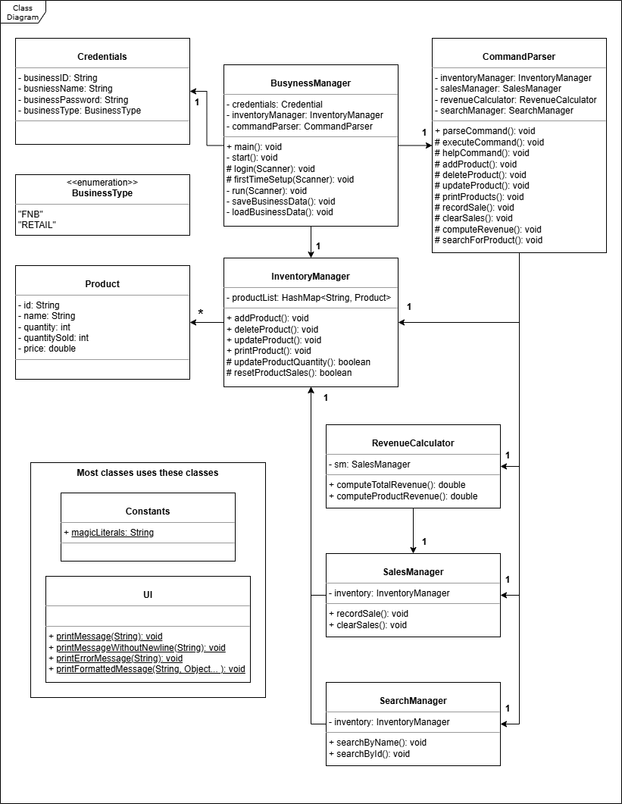

# Developer Guide

## Acknowledgements

<!-- @@author amirhusaini06 -->
* [CS2113 individualProject (amirhusaini06)](https://github.com/amirhusaini06/ip)

<!-- @@author b1inmeister -->
* [CS2113 individualProject (b1inmeister)](https://github.com/b1inmeister/ip)

<!-- @@author LEESY02 -->
* [CS2113 individualProject (LEESY02)](https://github.com/LEESY02/ip) 

---

## Design

<!-- @@author amirhusaini06 -->
The **Busyness Manager** is a command-line business management application designed for small business owners to manage 
their inventory, sales, and revenue tracking efficiently.

### Architecture Overview

* The project follows an **Object-Oriented Programming (OOP)** approach, with separate classes handling different 
aspects of business management.
* The **Command Parser** is responsible for processing user input and calling the appropriate methods.
* The **InventoryManager** manages the addition, removal, and modification of products.
* The **SalesManager** keeps track of product sales and revenue.
* The **RevenueCalculator** computes total revenue and sales reports.
* The **Credentials** class stores business authentication details, ensuring security.
* The **BusynessManager** acts as the central controller, orchestrating interactions between components.

---

<!-- @@author LEESY02 -->
**Below is a UML Class Diagram of the Classes present in the application.**

---

<!-- @@author amirhusaini06 -->
### Key Features & Implementation Details

* **Data Persistence:** Business credentials and inventory data are stored in a text file within the `data/` directory, 
ensuring persistence across application restarts.
* **Authentication:** The application verifies business credentials at startup using stored authentication data.
* **User Commands:** The application accepts structured user input through a command-line interface, with validation for
incorrect formats.

<!-- @@author LEESY02 -->
The purpose of this application was to help businesses account for their sales and revenue.

Hence, we required multiple different classes to manage various different aspects of a business owner, such as:

1. Product and Inventory
2. Sales
3. Revenue
4. An appropriate and usable UI for the business to keep track of the above factors

The inventory of each business is therefore handled by a InventoryManager class, which contains a hashmap of various
key-value pairs of String ID and Product objects.

Each Product object contains various useful attributes, such as:

1. String ID
2. String name (of the product)
3. Current stock quantity
4. Quantity sold
5. Price of each instance of the product

InventoryManager (IM), while holding onto these objects in a data structure, has various methods to modify and display
every product that is present in the business.

To utilise these functionalities present in IM, SalesManager and SearchManager each has an instance of the same
InventoryManager object. For example, SalesManager will be in charge of recording the quantity sold of each item
while the SearchManager helps business owners to search and keep track of each product.

To calculate the revenue of the business (or each sales item), the RevenueCalculator class has an instance of
SalesManager to calculate the revenue using the "Price" and "Quantity sold" of each Product object.

To have an appropriate and usable interface for the users, we have the UI class, that handles printing of the different
output to its users, while the CommandParser class receives inputs and commands from its users.

All of these features are contained under the main BusynessManager class to provide its users a smooth experience in
taking care of the different needs of businesses.

---

## Implementation

### BusynessManager class

The `BusynessManager` class is the class with the main() method, it holds and takes care of all relevant classes to run
the program.

**Member Variables**

* **`Credentials credentials`** - Credentials of the logged in Business.
* **`InventoryManager inventoryManager`** - Inventory of the logged in Business.
* **`CommandParser commandParser`** - Instance of CommandParser to run commands based on user inputs.

**BusynessManager Class Methods**

* **`BusynessManager()`**
  * Instantiates InventoryManager and CommandParser. (and other required classes)
* **`main(String[] args)`**
  * Starting point of the program, creates and new instance of BusynessManager and calls start().
* **`start()`**
  * Receives input of the Business Name from the user.
  * If Business exists in the database, calls:
    * loadBusinessData(businessName)
    * login(scanner, businessName)
  * If Business does not exist in the database, calls: (After prompt)
    * firstTimeSetup(scanner)
  * Calls run(scanner) if the login/setup process is successful.
* **`login(Scanner scanner, String businessName)`**
  * Allows user to proceed if the input Business ID and password matches that in the credentials.
  * Credentials are loaded in from loadBusinessData(businessName).
* **`firstTimeSetup(Scanner scanner)`**
  * Sets up a new Business (user) by extracting relevant information.
  * The following private methods are used within this method: 
    * extractID(scanner)
    * extractName(scanner)
    * extractPassword(scanner)
    * extractBusinessType(scanner)
* **`run(Scanner scanner)`**
  * Receives input from user and passes it to CommandParser to run the actual commands.
* **`saveBusinessData(String businessName)`**
  * Saves relevant data into a txt file present in ./data folder.
    * If business name is "Milk Corp", a text file names "Milk Corp.txt" is created in the data folder.
  * Relevant data includes:
    * Business ID
    * Business Name
    * Password
    * Business type
    * Inventory (Every Product instance and relevant attributes)
* **`loadBusinessData(String businessName)`**
  * Loads in business data, based on the data saved by saveBusinessData(String businessName).
* **`getBusinessDetails()`**
  * Used by CommandParser.
* **`getInventoryManager()`**
  * Used by CommandParser.

**Interactions with Other Components**

* **`Credentials`** - `BusynessManager` has an instance of **`Credentials`** for authorizing logins.
* **`InventoryManager`** - Used to save and load data between `InventoryManager` and data folder.
* **`CommandParser`** - Used to execute various commands.

---

<!-- @@author himethcodes -->
### Product class

The `Product` class represents an individual item in the business inventory. It contains the following attributes:

**Member Variables**

* **`String id`** - A unique identifier for the product.
* **`String name`** - The name of the product.
* **`int quantity`** - The current quantity available for sale.
* **`int quantitySold`** - The number of units sold.
* **`double price`** - The price of each unit of the product.
* **`double revenue`** - The revenue earned from of each product.

**Product Class Methods**

* **`Product(String name, int quantity, double price)`**
  * Constructor to initialize a new product.
* **`getId()`**
  * Returns the product ID.
* **`getName()`**
  * Returns the product name.
* **`getQuantity()`**
  * Returns the available stock quantity.
* **`getQuantitySold()`**
  * Returns the total quantity sold.
* **`getPrice()`**
  * Returns the product price.
* **`getRevenue()`**
  * Returns the revenue earned from the product so far.

---

### InventoryManager class

The `InventoryManager` class manages all `Product` objects in the inventory. It maintains a `HashMap` where the key is
the product ID, and the value is the corresponding `Product` object.

**Member Variables**

* **`HashMap<String, Product> inventory`** - Stores product details using a key-value structure.

**InventoryManager Class Methods**

* **`addProduct(String name, int qty, double price)`**
  * Adds a new product to the inventory.
* **`deleteProduct(String id)`**
  * Removes a product from the inventory.
* **`printProducts()`**
  * Displays all products in the inventory.
* **`updateProduct(String id, String name, int qty, double price)`**
  * Updates the details of an existing product.
  <!-- @@author LEESY02 --> 
  * To update attributes 1 by 1, there are also:
    * updateName(String id, String name)
    * updateQty(String id, int qty)
    * updatePrice(String id, double price)
* **`updateProductQuantity(String id, int qtySold)`**
  * Update attributes quantity and quantitySold of the specified product. (given by the String id parameter)
* **`resetProductSales(String id)`**
  * Resets attribute quantitySold to 0.
* **`returnProductList()`**
  * Returns the HashMap containing the ID and Product key-value pairs.
* **`updateRevenue(String id, int qtySold)`**
  * Updates revenue of Product.
* **`getInventoryData()`**
  * Returns a String containing the different attributes of all present Product instances in the HashMap.
* **`loadInventory(BufferedReader reader)`**
  * Loads a previous saved state into an instance of InventoryManager.

<!-- @@author himethcodes -->
**Interactions with Other Components**

* **`SalesManager`** - Uses `InventoryManager` to update stock and record sales.
* **`SearchManager`** - Uses `InventoryManager` to search for products.
* **`RevenueCalculator`** - Fetches product price and revenue from `InventoryManager` to calculate total revenue.
* **`CommandParser`** - Calls `InventoryManager` methods based on user input.
* **`BusynessManager`** - Calls `InventoryManager` methods to load and save business data.

---

<!-- @@author rozaliesmit -->
### SalesManager class

The `SalesManager` class manages sales transactions, updating inventory levels and tracking quantities sold. It acts as
an intermediary between the user interface and the InventoryManager, ensuring that sales are recorded accurately and
inventory is adjusted accordingly.

**Member Variables**

* **`InventoryManager inventory`** -  Stores a reference to the `InventoryManager` class, allowing the `SalesManager`
  to interact with the inventory data.

**SalesManager Class Methods**

* **`SalesManager(InventoryManager inventory)`**
  * Constructs a `SalesManager` class with a given `InventoryManager`.
* **`recordSale(String id, int qty Sold)`**
  * Records a sale of a specified quantity of a product with the given ID.
  * Private method checkIfInvalidQuantity(int qtySold), checks if the provide qtySold value is a positive value.
  * Calls updateRevenue() from InventoryManager to save the updated revenue value from the sale. 
* **`clearSales(String id)`**
  * Resets the sales data for a product with the given ID.
* **`getInventory()`**
  * Returns the `InventoryManager` class used by the `SalesManager`.

**Interactions with Other Components**

* **`InventoryManager`** - `SalesManager` relies on the `InventoryManager` to update product quantities and reset sales 
data.
* **`RevenueCalculator`** - Uses `SalesManager` to compute total sales to compute total and individual product revenue.
* **`CommandParser`** - Calls `SalesManager` to execute sales-related commands entered by the user.

---

<!-- @@author LEESY02 -->
### RevenueCalculator class

The `RevenueCalculator` calculates and displays revenue generated from various transactions.

**Member Variables**

* **`SalesManager sm`** -  Stores a reference to the `SalesManager` class, the `SalesManager`
  interacts with the inventory data and fetches/updates relevant revenue data.

**RevenueCalculator Class Methods**

* **`RevenueCalculator(SalesManager sm)`**
  * Constructs a `RevenueCalculator` class with a given `SalesManager`.
* **`computeTotalRevenue()`**
  * Computes the total revenue generated from all Product instances present in InventoryManager. 
  (present in SalesManager)
* **`computeProductRevenue(String id)`**
  * Computes the revenue generated from the specified Product instance.
* **`computeIndividualRevenue(Product product)`**
  * A private method that returns the revenue attribute of the given product.
  * Used by both computeTotalRevenue() and computeProductRevenue(String id).
* **`returnProductList()`**
  * Returns the HashMap containing ID and Product key-value pairs (taken from InventoryManager inside SalesManager).
* **`printProductRevenue(Product product, double individualRevenue)`**
  * A private method that prints out the revenue generated from the given Product instance.

**Interactions with Other Components**

* **`SalesManager`** - `RevenueCalculator` relies on the `SalesManager` to update product quantities and reset sales
  data.
* **`CommandParser`** - Calls `RevenueCalculator` to execute revenue-related commands entered by the user.

---

### SearchManager class

The `SearchManager` searches for different Product instances, given the Product's name or ID.

**Member Variables**

* **`InventoryManager Inventory`** - Stores a reference to the `InventoryManager` class, the `SearchManager`
  interacts with the inventory data and fetches relevant data to display to the user as a search result.

**SearchManager Class Methods**

* **`SearchManager(InventoryManager inventory)`**
  * Constructs a `SalesManager` class with a given `InventoryManager`.
* **`searchByName(String name)`**
  * Searches for a Product with the given String name.
* **`searchById(String id)`**
  * Searches for a Product with the given String ID.
* **`checkForProductByName(String name, Set<Map.Entry<String, Product>> mapSet)`**
  * A private method that returns true if given String name is present in the Set.
  * Used by searchByName(String name)
* **`checkForProductById(String id, HashMap<String, Product> currentProductList)`**
  * A private method that returns true if given String ID is present in the HashMap.
  * Used by searchById(String id).

**Interactions with Other Components**

* **`InventoryManager`** - `SearchManager` relies on the `InventoryManager` to search for products.
* **`CommandParser`** - Calls `SearchManager` to execute search-related commands entered by the user.

---

<!-- @@author b1inmeister -->
### CommandParser class

The CommandParser class connects the main BusynessManager class with the other Manager classes, and is called when the 
BusynessManager class detects user input. It takes in the user input as a String, and undergoes 3 steps to execute the 
user input, before giving back control to the user by returning to the BusynessManager class. 

The 3 steps is as follows:

1. Splitting the user input String
2. Executing the command
3. Manipulating the information

**Splitting the user input String**

1. `parseCommand()` in the CommandParser class is called, taking in the user input as a String.
2. The user input is split into the "command" and the "information" portions. 
   * "command": A one-word String defines what task the user wants Busyness Manager to do,
   * "information": Contains the relevant information for that task. (e.g. product ID / name / quantity / price) 
3. To split the user input String, `parseCommand()` calls 3 sub-methods.
   * `getCommandSeparatorIndex()`: Returns the index of the first space of the user input String. 
     * The first space will be returned, as the "command" is a one-word String, which will be the first word of the 
     user input. 
   * `splitCommand()` and `splitInfo()`: Returns the "command" and the "information" respectively. 
     * Both sub-methods utilise `.substring()` from Java's String class.
  
**Executing the command**

1. `parseCommand()` calls `executeCommand()`, with the "command" and the "information" as parameters. 
2. The "command" is passed into a switch statement that determines what command method the parser should execute. 
   * For example, in the sequence diagram above, if the "command" is the one-word String `add`, the switch statement 
   will call `addProduct()` with the "information" as a parameter.

**Manipulating the information**

*Note: from here on, it is assumed that `add` is the "command".*

1. The command method extracts the relevant attributes from the "information" String. 
   * This is done using `.split()` from Java's String class, which outputs an array of Strings.
2. The product **name** is extracted directly from the index immediately after the "command". 
   * However, only one-word Strings can be extracted as the product name using this method. Hence, the name of products
   in the program are restricted to one-word Strings. This limitation will be addressed in later versions.
3. *(applicable to other methods besides `add`)* The product **ID** is extracted from the index immediately after the
   "command".
   * Since the product ID needs to be of type `int` and not `String` for formatting purposes, the attribute undergoes
     parsing to an integer type,
   * The product ID is then formatted to the ID format (ID_XXXX) and converted back to a String.
4. The product **quantity** and **price** are extracted from the subsequent indexes.
   * Since the product quantity and price need to be of type `int` and not `String`, the attribute undergoes parsing to
   an integer type.
5. When the attributes have been extracted, the command method will call its counterpart in the relevant Manager class.
   * After this counterpart has finished executing, the command method will return, followed by `executeCommand()` and 
   `parseCommand()`.
6. CommandParser returns to the BusynessManager class, giving input control back to the user.

*Note:* This concept of attribute extraction applies to most command execution methods. However, for printing of the 
product list and computation of total revenue, since there is no "information" required for their command methods, they
will not require attribute extraction.

---

<!-- @@author LEESY02 -->
### Credentials class

**Member Variables**

* **`String businessID`** - String ID for Business.
* **`String businessName`** - String name of Business.
* **`String businessPassword`** - String password of Business.
* **`BusynessManager.BusinessType businessType`** - Enum in `BusynessManager` that contains the different Business 
types.

**Credentials Class Methods**

* All methods in Credentials are getters for their respective attributes. (Member Variables)
  * **`getBusinessID()`**
  * **`getBusinessName()`**
  * **`getBusinessPassword()`**
  * **`getBusinessType()`**

**Interactions with Other Components**

* **`BusynessManager`** - Used by BusynessManager to load and verify user (business) credentials during login, as well
as during saving of data.

---

### Constants class
`Constants` class is used to hold static constants used during printing of messages using UI class or Magic Literals
required during the execution of the program.

**Member Variables**

* Contains static constants used for printing messages in the UI class.

**Interactions with Other Components**

* **`UI`** - Uses values from the Constants class to print output to the user.
* Almost all classes uses Magic Literals from this class.

---

### UI class
`UI` class is used to print outputs to user (Abstraction of printing output).

**UI Class Methods**

* `printMessageWithoutNewline(String message)`
* `printMessage(String message)`
* `printErrorMessage(String message)`
* `printFormattedMessage(String message, Object... args)`

*Note:* All methods in UI Class are static. (class level)

**Interactions with Other Components**

* **`Constants`** - Constants variable from this class is used by `UI` for printing.
* Almost all classes uses UI class for printing

---

<!-- @@author b1inmeister -->
## Product Scope

### Target user profile

* Involved in a business that sells goods (i.e. physical products).
  * This business is a for-profit business.
  * This business sells a variety of goods.
  * This business is not a large business with a single outlet. (e.g. mini-mart / cafe)
* Prefer desktop applications over other types.
* Prefer typing over using a mouse to navigate menus.
* Has the ability to type reasonably fast and accurately.
* Is used to handling CLI applications.

### Value Proposition

Busyness Manager can manage the inventory of a business in a faster and more organised way than a typical GUI-driven 
application. Moreover, it is cheaper to run and maintain, compared to other inventory management applications in the 
market.

---

## User Stories

| Version |                 As a ...                 |                    I want to ...                     |                        So that I can ...                        |
|:-------:|:----------------------------------------:|:----------------------------------------------------:|:---------------------------------------------------------------:|
|  v1.0   |              business owner              | adapt my configuration according to my business type |              manage my business based on its needs              |
|  v1.0   | business owner with new products to sell |             add products to my database              |           indicate that these products are to be sold           |
|  v1.0   |  business owner with outdated products   |           remove products from my database           | indicate that my business is not selling these products anymore |
|  v1.0   |         forgetful business owner         |           see all my products in one list            |            find out what products my business sells             |
|  v1.0   |          curious business owner          |     see the data of the products in my database      |       find out more about the performance of that product       |
|  v1.0   |              business owner              |     modify the data of a product in my database      |        keep the information about my product up-to-date         |
|  v1.0   |    business owner with many products     |         search for a product in my database          |         find out if that product is sold by my business         |
|  v1.0   |        for-profit business owner         |                    track my sales                    |            manage my business in a profitable manner            |
|  v2.0   |         forgetful business owner         |     have a list of possible commands and formats     |                 recall what commands I can use                  |
|  v2.0   |              business owner              |                   save my database                   |   reuse the existing database when I restart the application    |

---

## Non-Functional Requirements

* Should work on any _mainstream OS_ with Java 17 installed.
* Should serve a business with up to 10,000 goods for sale.
* Should work with products with quantity below 1,000,000.
* Should work with products with price below $1,000,000.
* A user with decent typing speed for normal text should be able to complete most tasks faster through typing
out commands, compared to using the mouse to navigate a GUI application.

---

## Glossary

<!-- @@author amirhusaini06 -->
* **Business Credentials** - Unique identifiers (ID, name, password) for a registered business.
* **Command Parser** - A component responsible for interpreting user commands and triggering appropriate actions.
* **Inventory Manager** - Manages stock, allowing addition, deletion, and updates of products.
* **Sales Manager** - Tracks product sales and ensures accurate revenue reporting.
* **Revenue Calculator** - Computes total revenue and generates sales reports.
* **CLI (Command-Line Interface)** - A text-based interface where users interact with the application. 
<!-- @@author b1inmeister -->
* **Mainstream OS** - Windows, Linux, Unix, macOS 

---

## Instructions for Manual Testing

### Launch

1. Download the `.jar` file and copy into an empty folder.
2. Open Command Prompt on Windows / Terminal on macOS.
3. Change the current working directory to the folder containing the `.jar` file.
4. run `java -jar <file name>.jar` on Command Prompt / Terminal.

### Sign-In Process

* When the program asks for the login details, **do not input anything** and press `Enter`.
  * *Example Input:* When `Please enter your business name:` is shown, press `Enter` without inputting anything.
  * *Output:* An error message stating that no input was detected will be shown.
* When the program asks for the login details, input an **incorrect set** of login information.
  * *Example Input:* When asked for the **business name**, input an incorrect name.
  * *Output:* The program will provide an option to create a new business account before termination.
  * *Example Input:* When asked for the **business ID and password**, input some incorrect information.
  * *Output:* The program will provide an option to display the ID and password before termination.

### First-Time setup

* When the program requests for Credentials information (e.g. ID / Name / Password / Business Type), **do not input 
anything** and press `Enter`.
  * *Example Input:* When `Enter Business ID:` is shown, press `Enter` without inputting anything.
  * *Output:* An error message stating that no input was detected will be shown.
* When the program requests for the ID, input **a String of letters**.
  * *Example Input:* `tralalero tralala`
  * *Output:* An error message stating that the ID must be a set of digits will be shown.
* When the program requests for the Business Type, input something **other than FNB or RETAIL**.
  * *Example Input:* `fnb` / `retail` / `SERVICE`
  * *Output:* An error message stating the Business Type is invalid will be shown. 

### Adding a product

* Input the `add` command with **missing attributes**.
  * *Example Input:* `add` / `add MILK 50` / `add WHITE_RICE 13.00` / `add 30 6.00`
  * *Output:* An error message stating that the format is incorrect will be shown.
* Input the `add` command with **negative values** for quantity and price.
  * *Example Input:* `add MILK -50 2.50` / `add EGGS 30 -6.00`
  * *Output:* An error message stating that the quantity and/or price cannot be negative will be shown.
* Input the `add` command with a **non-proper value** for quantity and/or price.
  * *Example Input:* `add MILK 50.4 2.50`/ `add MILK 50 hi` / `add XD XD XD`
  * *Output:* An error message stating that the quantity and/or price is not a proper number will be shown.
* Input the `add` command with the price as **zero**.
  * *Example Input:* `add MILK 50 0.00`
  * *Output:* An error message stating that the price cannot be zero will be shown.

### Deleting a product

* Input the `delete` command with **missing attributes**.
  * *Example Input:* `delete`
  * *Output:* An error message stating that the ID is missing will be shown.
* Input the `delete` command with an **invalid ID**.
  * *Example Input:* `delete XD`
  * *Output:* An error message stating that the ID is invalid will be shown.
* Input the `delete` command with an ID that **does not exist in the product list**.
  * *Example Input:* `delete 15` (when there are 5 products in the list)
  * *Output:* An error message stating that the product with the provided ID cannot be found will be shown.

### Updating a product

* Input the `update` command with **missing attributes**.
  * *Example Input:* `update` / `update /name` / `update 1 /qty` / `update 2 /price`
  * *Output:* An error message stating that the flags are invalid will be shown.
* Input the `update` command with an **invalid ID**.
  * *Example Input:* `update XD /name MILK`
  * *Output:* An error message stating that the ID is invalid will be shown.
* Input the `update` command with an ID that **does not exist in the product list**.
  * *Example Input:* `update 15 /qty 50` (when there are 5 products in the list)
  * *Output:* An error message stating that the product with the provided ID cannot be found will be shown.
* Input the `update` command with **negative values** for quantity and price.
  * *Example Input:* `update 1 /qty -50 2.50` / `update 2 /price -6.00`
  * *Output:* An error message stating that the quantity and/or price cannot be negative will be shown.
* Input the `update` command with a **non-whole number value** for quantity and/or price.
  * *Example Input:* `update 1 /qty 50.4` / `update 2 /price hi` 
  * *Output:* An error message stating that the quantity and/or price is not a proper number will be shown.
* Input the `update` command with the price as **zero**.
  * *Example Input:* `update 1 /price 0.00`
  * *Output:* An error message stating that the price cannot be zero will be shown.

### Searching a product

* Input the `search` command with **an invalid format**.
  * *Example Input:* `search` / `search XD`
  * *Output:* An error message stating that the format is incorrect will be shown.
* Input the `search` command with **missing attributes**.
  * *Example Input:* `search /name` / `search /id`
  * *Output:* An error message stating that the name or ID is missing will be shown.
* Input the `search` command with a name that **does not exist in the product list**.
  * *Example Input:* `search /name BEANS`
  * *Output:* An error message stating that the product with the provided name cannot be found will be shown.
* Input the `search` command with an **invalid ID**.
  * *Example Input:* `search /id XD`
  * *Output:* An error message stating that the ID is invalid will be shown.
* Input the `search` command with an ID that **does not exist in the product list**.
  * *Example Input:* `search /id 15` (when there are 5 products in the list)
  * *Output:* An error message stating that the product with the provided ID cannot be found will be shown.

### Managing Sales

* Input the `sold` command with **missing attributes**.
  * *Example Input:* `sold` / `sold 5` (where 5 is the quantity) / `sold 1` (where 1 is the ID)
  * *Output:* An error message stating that the format is incorrect will be shown.
* Input the `sold` command with an **invalid ID**.
  * *Example Input:* `sold XD 5`
  * *Output:* An error message stating that the ID is invalid will be shown.
* Input the `sold` command with an ID that **does not exist in the product list**.
  * *Example Input:* `sold 15 5` (when there are 5 products in the list)
  * *Output:* An error message stating that the product with the provided ID cannot be found will be shown.
* Input the `sold` command with a **negative value** for quantity.
  * *Example Input:* `sold 1 -5`
  * *Output:* An error message stating that the quantity cannot be negative will be shown.
* Input the `sold` command with a **non-whole number value** for quantity.
  * *Example Input:* `sold 1 5.6` / `sold 1 hi`
  * *Output:* An error message stating that the quantity must be a whole number will be shown.

### Clearing Sales

* Input the `clear` command with **missing attributes**.
  * *Example Input:* `clear`
  * *Output:* An error message stating that there are missing attributes will be shown.
* Input the `clear` command with an **invalid ID**.
  * *Example Input:* `clear XD`
  * *Output:* An error message stating that the ID is invalid will be shown.
* Input the `clear` command with an ID that **does not exist in the product list**.
  * *Example Input:* `clear 15` (when there are 5 products in the list)
  * *Output:* An error message stating that the product with the provided ID cannot be found will be shown.

### Calculation of Revenue

* Input the `revenue` command with an **invalid ID**.
  * *Example Input:* `revenue XD`
  * *Output:* An error message stating that the ID is invalid will be shown.
* Input the `revenue` command with an ID that **does not exist in the product list**.
  * *Example Input:* `revenue 15` (when there are 5 products in the list)
  * *Output:* An error message stating that the product with the provided ID cannot be found will be shown.
