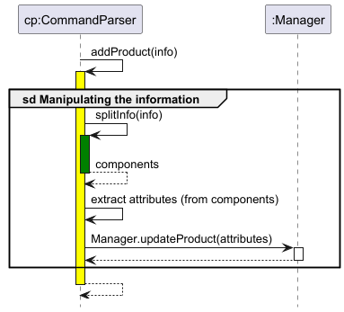

# Developer Guide

## Acknowledgements
<!-- @@author amirhusaini06 -->
* [CS2113 individualProject (amirhusaini06)](https://github.com/amirhusaini06/ip)
<!-- @@author b1inmeister -->
* [CS2113 individualProject (b1inmeister)](https://github.com/b1inmeister/ip) 
<!-- @@author LEESY02 -->
* [CS2113 individualProject (LEESY02)](https://github.com/LEESY02/ip) 

## Design
<!-- @@author amirhusaini06 -->
The **Busyness Manager** is a command-line business management application designed for small business owners to manage 
their inventory, sales, and revenue tracking efficiently.

### Architecture Overview
- The project follows an **Object-Oriented Programming (OOP)** approach, with separate classes handling different 
aspects of business management.
- The **Command Parser** is responsible for processing user input and calling the appropriate methods.
- The **InventoryManager** manages the addition, removal, and modification of products.
- The **SalesManager** keeps track of product sales and revenue.
- The **RevenueCalculator** computes total revenue and sales reports.
- The **Credentials** class stores business authentication details, ensuring security.
- The **BusynessManager** acts as the central controller, orchestrating interactions between components.

### Key Features & Implementation Details
- **Data Persistence:** Business credentials and inventory data are stored in a text file within the `data/` directory, 
ensuring persistence across application restarts.
- **Authentication:** The application verifies business credentials at startup using stored authentication data.
- **User Commands:** The application accepts structured user input through a command-line interface, with validation for
incorrect formats.

<!-- @@author LEESY02 -->
The purpose of this application was to help businesses account for their sales and revenue.

Hence, we required multiple different classes to manage various different aspects of a business owner, such as:
1. Product and Inventory
2. Sales
3. Revenue
4. An appropriate and usable UI for the business to keep track of the above factors

The inventory of each business is therefore handled by a InventoryManager class, which contains a hashmap of various
key-value pairs of String ID and Product objects.

Each Product object contains various useful attributes, such as:
1. String ID
2. String name (of the product)
3. Current stock quantity
4. Quantity sold
5. Price of each instance of the product

InventoryManager (IM), while holding onto these objects in a data structure, has various methods to modify and display
every product that is present in the business.

To utilise these functionalities present in IM, SalesManager and SearchManager each has an instance of the same
InventoryManager object. For example, SalesManager will be in charge of recording the quantity sold of each item
while the SearchManager helps business owners to search and keep track of each product.

To calculate the revenue of the business (or each sales item), the RevenueCalculator class has an instance of
SalesManager to calculate the revenue using the "Price" and "Quantity sold" of each Product object.

To have an appropriate and usable interface for the users, we have the UI class, that handles printing of the different
output to its users, while the CommandParser class receives inputs and commands from its users.

All of these features are contained under the main BusynessManager class to provide its users a smooth experience in
taking care of the different needs of businesses.

## Implementation
<!-- @@author himethcodes -->
### Product class
The `Product` class represents an individual item in the business inventory. It contains the following attributes:

**Attributes**
- **`String id`** - A unique identifier for the product.
- **`String name`** - The name of the product.
- **`int quantity`** - The current quantity available for sale.
- **`int quantitySold`** - The number of units sold.
- **`double price`** - The price of each unit of the product.

**Product Class Methods**
- **`Product(String name, int quantity, double price)`**
  - Constructor to initialize a new product.

- **`getId()`**
  - Returns the product ID.

- **`getName()`**
  - Returns the product name.

- **`getQuantity()`**
  - Returns the available stock quantity.

- **`getQuantitySold()`**
  - Returns the total quantity sold.

- **`getPrice()`**
  - Returns the product price.

### InventoryManager class
The `InventoryManager` class manages all `Product` objects in the inventory. It maintains a `HashMap` where the key is
the product ID, and the value is the corresponding `Product` object.

**Member Variables**
- **`HashMap<String, Product> inventory`** - Stores product details using a key-value structure.

**InventoryManager Class Methods**
- **`addProduct(String name, int qty, double price)`**
  - Adds a new product to the inventory.

- **`deleteProduct(String id)`**
  - Removes a product from the inventory.

- **`updateProduct(String id, String name, int qty, double price)`**
  - Updates the details of an existing product.

- **`printProducts()`**
  - Displays all products in the inventory.

**Interactions with Other Components**
- **`SalesManager`** - Uses `InventoryManager` to update stock and record sales.
- **`SearchManager`** - Uses `InventoryManager` to search for products.
- **`RevenueCalculator`** - Fetches product price and quantity sold from `InventoryManager` to calculate total revenue.
- **`CommandParser`** - Calls `InventoryManager` methods based on user input.

<!-- @@author rozaliesmit -->
### SalesManager class
The `SalesManager` class manages sales transactions, updating inventory levels and tracking quantities sold. It acts as
an intermediary between the user interface and the InventoryManager, ensuring that sales are recorded accurately and
inventory is adjusted accordingly.

**Member Variables**
- **`InventoryManager inventory`** -  Stores a reference to the `InventoryManager` class, allowing the `SalesManager`
  to interact with the inventory data.

**SalesManager Class Methods**
- **`SalesManager inventory`**
  - Constructs a `SalesManager` class with a given `InventoryManager`.

- **`recordSale(String id, int qty Sold)`**
  - Records a sale of a specified quantity of a product with the given ID.

- **`clearSales(String id)`**
  - Resets the sales data for a product with the given ID.

- **`getInventory()`**
  - Returns the `InventoryManager` class used by the `SalesManager`.

**Interactions with Other Components**
- **`InventoryManager`** - `SalesManager` relies on the `InventoryManager` to update product quantities and reset sales 
data.
- **`RevenueCalculator`** - Uses `SalesManager` to compute total sales to compute total and individual product revenue.
- **`CommandParser`** - Calls `SalesManager` to execute sales-related commands entered by the user.

<!-- @@author b1inmeister -->
### CommandParser class

The CommandParser class connects the main BusynessManager class and the other Manager classes. These include the 
InventoryManager, SalesManager, SearchManager and RevenueCalculator class. When the BusynessManager class detects user
input, it calls the CommandParser class and provides the user input as a String. At this point, the CommandParser goes 
through 3 steps to execute the user input, before giving back control to the user by returning to the BusynessManager 
class. 

The 3 steps is as follows:
1. Splitting user input String
2. Executing the command
3. Manipulating the information

**Splitting user input String**

When the BusynessManager class detects user input, it calls `parseCommand()` in the CommandParser class, giving this
method the user input as a String. It will then split the user input into the "command" and the "information" portions.
The "command" portion is defined as a one-word String that will define which task the user wants Busyness Manager to do,
while the "information" portion contains the relevant information for that task. For instance, the "information" can 
include the product ID, name, quantity and price. To split the user input String, `parseCommand()` calls 3 sub-methods.
Firstly, the CommandParser class calls `getCommandSeparatorIndex()` which will return the index of the first space of 
the user input String. The first space will be returned, as the "command" is a one-word String, which will be the first
word of the user input. After that, `parseCommand()` calls `splitCommand()` and `splitInfo()` which returns the 
"command" and the "information" respectively. Both sub-methods utilise `.substring()` that is from Java's String class.

**Executing the command**

After the "command" and "information" have been extracted, `parseCommand()` calls `executeCommand()`, with the "command"
and the "information" as parameters. Within this method, the "command" is passed into a switch statement, which 
determines which command method the parser should execute. For example, in the sequence diagram above, if the "command" 
is the one-word String `add`, the switch statement will call `addProduct()` with the "information" as a parameter. If 
the "command" does not correspond to any of the possible commands, `executeCommand()` will throw a 
`InvalidCommandException` which will output an error message to the user that their "command" does not exist, and is 
therefore invalid.

**Manipulating the information**

After calling the appropriate command execution method, the command execution method will extract the relevant 
attributes from the "information" String. This is done using `.split()` from Java's String class, which outputs
an array of Strings. Before extracting the attributes, the method checks if the correct tags have been inputted by the 
user. This is done through the finding the index where the tag is expected to be, and checking the String in that index
with the expected tag using `.equals()` from Java's String class. If the inputted tags are deemed correct, the 
extraction of attributes will begin. Throughout the extraction of attributes segment, due to the use of an array,
exception handling of `ArrayOutOfBoundsException` is done. In the scenario where this exception is thrown,
`InvalidCommandException` will also be thrown, and later caught when the command execution method returns.

For the product **name**, since it is expected to be of type `String`, the attribute is extracted directly from the index 
immediately after the index that contains `/name`. 

For the product **quantity** or **price**, the attribute will be extracted from the index immediately after the index that
contains `/qty` `/price` respectively. After that, since we require the product quantity and price to be of type `int`
and not `String`, the attribute will undergo parsing to an integer type, with appropriate exception handling. This
integer is the final result from the attribute extraction of the product quantity or price.

For the product **ID**,  the attribute will be extracted from the index immediately after the index that contains `/id`. 
After that, since we require the product ID to be of type `int` and not `String` for formatting purposes, the attribute 
will undergo parsing to an integer type, with appropriate exception handling. Next, there is a check to confirm that the
inputted ID is within the maximum size of a product list, which is 9999 due to the ID format (ID_XXXX where X represents 
a digit). If the check is satisfactory, the product ID is then formatted to the ID format (ID_XXXX) and converted back 
to a String. This String is the final result from the attribute extraction of the product ID.

When the attributes have been extracted, the command execution method will call its counterpart located in the relevant
Manager class. The counterpart in the Manager class is the method that actually performs the task inputted by the user.
After this counterpart has returned, the command execution method will also return, followed by `executeCommand()` and 
`parseCommand()`. Finally, CommandParser returns to the BusynessManager class, giving input control back to the user.

*Note:* The manipulating information description applies to most command execution methods. However, for printing of the 
product list and computation of total revenue, since there is no "information" required for their command execution 
methods, they will skip the extraction of attributes portion.

## Product Scope
### Target user profile
* Involved in a business that sells goods (i.e. physical products).
  * This business is a for-profit business.
  * This business sells a variety of goods.
* Prefer desktop applications over other types.
* Prefer typing over using a mouse to navigate menus.
* Has the ability to type reasonably fast and accurately.
* Is used to handling CLI applications.

### Value Proposition
Busyness Manager can manage the inventory of a business in a faster and more organised way than a typical GUI-driven 
application. Moreover, it is cheaper to run and maintain, compared to other inventory management applications in the 
market.

## User Stories

| Version |                 As a ...                 |                    I want to ...                     |                        So that I can ...                        |
|:-------:|:----------------------------------------:|:----------------------------------------------------:|:---------------------------------------------------------------:|
|  v1.0   |              business owner              | adapt my configuration according to my business type |              manage my business based on its needs              |
|  v1.0   | business owner with new products to sell |             add products to my database              |           indicate that these products are to be sold           |
|  v1.0   |  business owner with outdated products   |           remove products from my database           | indicate that my business is not selling these products anymore |
|  v1.0   |         forgetful business owner         |           see all my products in one list            |            find out what products my business sells             |
|  v1.0   |          curious business owner          |       the data of the products in my database        |       find out more about the performance of that product       |
|  v1.0   |              business owner              |     modify the data of a product in my database      |        keep the information about my product up-to-date         |
|  v1.0   |    business owner with many products     |         search for a product in my database          |         find out if that product is sold by my business         |
|  v1.0   |        for-profit business owner         |                    track my sales                    |            manage my business in a profitable manner            |
|  v2.0   |         forgetful business owner         |     have a list of possible commands and formats     |                 recall what commands I can use                  |
|  v2.0   |              business owner              |                   save my database                   |   reuse the existing database when I restart the application    |

## Non-Functional Requirements
* Should work on any _mainstream OS_ with Java 17 installed.
* Should serve a business with up to 10,000 goods for sale.
* A user with decent typing speed for normal text should be able to complete most tasks faster through typing
out commands, compared to using the mouse to navigate a GUI application.

## Glossary
<!-- @@author amirhusaini06 -->
* **Business Credentials** - Unique identifiers (ID, name, password) for a registered business.
* **Command Parser** - A component responsible for interpreting user commands and triggering appropriate actions.
* **Inventory Manager** - Manages stock, allowing addition, deletion, and updates of products.
* **Sales Manager** - Tracks product sales and ensures accurate revenue reporting.
* **Revenue Calculator** - Computes total revenue and generates sales reports.
* **CLI (Command-Line Interface)** - A text-based interface where users interact with the application. 
<!-- @@author b1inmeister -->
* **Mainstream OS** - Windows, Linux, Unix, macOS 

## Instructions for Manual Testing
### Launch
1. Download the `.jar` file and copy into an empty folder.
2. Open Command Prompt on Windows / Terminal on macOS.
3. Change the current working directory to the folder containing the `.jar` file.
4. run `java -jar <file name>.jar` on Command Prompt / Terminal.

### Adding a product
* Try tags without `/` / missing tags / missing tag attributes
* Try negative quantities for `/qty` and `/price`

### Deleting a product
* Try tags without `/` / missing tag attributes
* Try invalid ID formats / non-existent IDs

### Updating a product
* Try tags without `/` / missing tags / missing tag attributes
* Try invalid ID formats / non-existent IDs
* Try negative quantities for `/qty` and `/price`

### Searching a product
* Try tags without `/` / missing tag attributes
* Try invalid ID formats / non-existent IDs

### Managing Sales
* Try tags without `/` / missing tags / missing tag attributes
* Try invalid ID formats / non-existent IDs
* Try negative quantities for `/qty`

### Calculation of Revenue
* Try tags without `/` / missing tag attributes
* Try invalid ID formats / non-existent IDs
